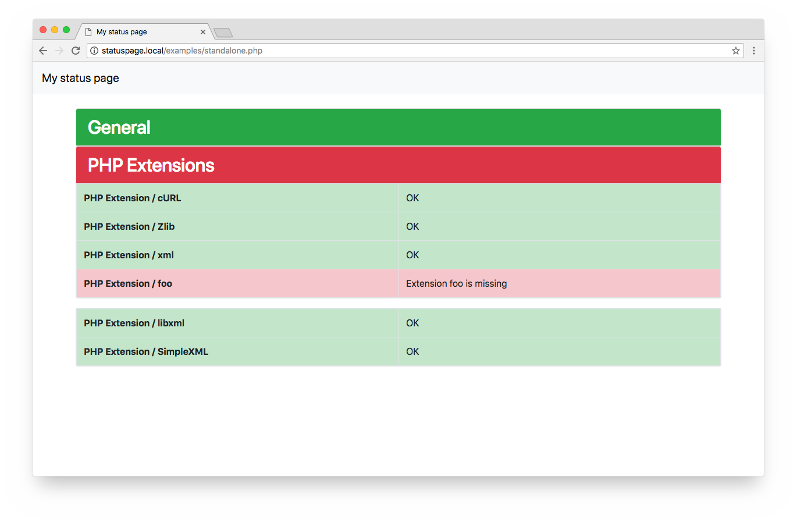

# StatusPage

[](https://packagist.org/packages/bretrzaun/statuspage)
[](https://travis-ci.org/bretrzaun/statuspage)
[](https://scrutinizer-ci.com/g/bretrzaun/statuspage/?branch=master)

Add a simple status page to applications with custom checks.

The status page runs all registered checks and renders a page showing its results.

<p align="center">
    
</p>

## Installation

```
composer require bretrzaun/statuspage
```

## Usage

```
$checker = new \BretRZaun\StatusPage\StatusChecker();
// add your checks here
$checker->addCheck(...);

// in different groups if you like
$group = new StatusCheckerGroup('Group 01');
$group->addCheck(...);
$group->addCheck(...);
$checker->addGroup($group);

// run the checks
$checker->check();

// use the built-in Twig template
$loader = new Twig_Loader_Filesystem('resources/views/');
$twig = new Twig_Environment($loader, ['autoescape' => false]);

$content = $twig->render(
    'status.twig',
        [
            'results' => $checker->getResults(),
            'title' => 'My status page'
        ]
    );
$code = $checker->hasErrors() ? 503 : 200;
// create a response with $content and $code
```

## Out-of-the-box checks

- **CallbackCheck**: generic check using a PHP callback function
- **DoctrineConnectionCheck**: checks for a valid [Doctrine DBAL](http://www.doctrine-project.org/projects/dbal.html) connection
- **ElasticsearchCheck**: checks an [Elasticsearch Client](https://github.com/elastic/elasticsearch-php) for successful pings
- **LogFileContentCheck**: check a (log) file for certain content
- **UrlCheck**: checks a URL
- **PhpExtensionCheck**: check a given PHP extension is loaded
- **PhpIniCheck**: check a value of php.ini
- **PhpMemoryLimitCheck**: check PHP memory limit
- **PhpVersionCheck**: check PHP version

### Custom checks

Custom checks can be easily added by inheriting `BretRZaun\StatusPage\Check\AbstractCheck`.

## Tests

To run the tests, just enter:

```
composer install
vendor/bin/phpunit
```
